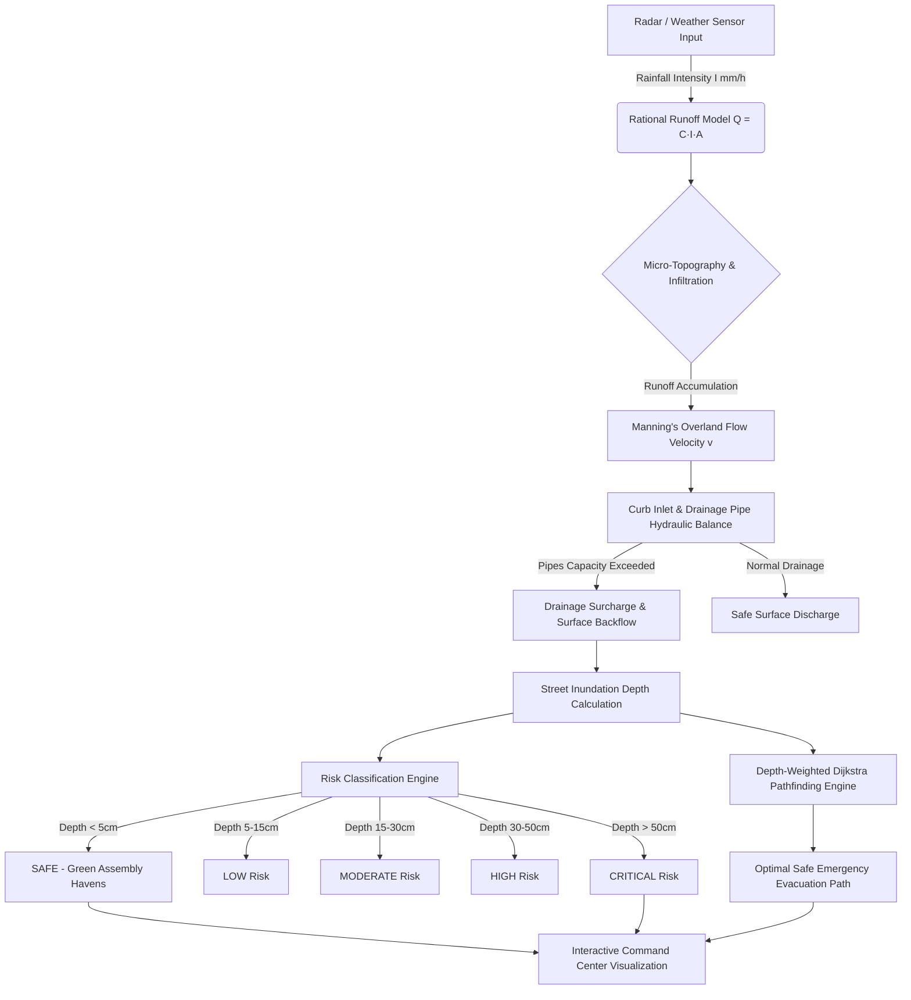

# 🌊 Urban Flood Nowcasting & Safe Assembly Emergency System

An end-to-end, real-time operational platform for urban flood risk prediction, drainage hydraulic diagnostics, dynamic inundation mapping, and AI-driven emergency routing.

Built for **Smart India Hackathon (SIH)** with a high-performance **Spring Boot 3.3 (Java 21)** backend, **Supabase PostgreSQL** cloud database, **React 18 + TypeScript + Leaflet** command center, and physics-informed hydrological nowcasting engines.

---

## 📌 Executive Summary

Urban flash floods in dense metropolitan zones develop rapidly due to high surface imperviousness, micro-topographic depressions, and localized drainage surcharges. Traditional weather forecasts provide macro-level rainfall estimates but fail to predict hyper-local street inundation depths and safe evacuation paths.

The **Urban Flood Nowcasting System** bridges this gap by combining **Doppler Radar/Weather Station nowcasts** with **Rational Method Hydrology**, **Manning's Overland Hydraulic Flow**, and **Depth-Weighted Dijkstra Navigation Algorithms**.

```
┌────────────────────────┐      ┌───────────────────────────┐      ┌───────────────────────────┐
│ Live Doppler Radar /   │ ───► │ Hydrological Runoff &     │ ───► │ Hydrodynamic Inundation   │
│ Weather Station        │      │ Infiltration Engine       │      │ & Drainage Pipe Surcharge │
└────────────────────────┘      └───────────────────────────┘      └───────────────────────────┘
                                                                                 │
                                                                                 ▼
┌────────────────────────┐      ┌───────────────────────────┐      ┌───────────────────────────┐
│ Dynamic Safe Assembly  │ ◄─── │ Safe Route Pathfinding    │ ◄─── │ Risk Level Classification │
│ & Relief Haves         │      │ (Depth-Weighted Dijkstra) │      │ (SAFE -> CRITICAL)        │
└────────────────────────┘      └───────────────────────────┘      └───────────────────────────┘
```

---

## ⚡ Key Features

- 🌧️ **Real-Time Hydrological Nowcasting**: Converts rainfall forecasts ($mm/h$, 0–180 minutes) into surface runoff volume and inlet inflow rates.
- 🌊 **Hyper-Local Street Inundation Depth**: Computes exact water depth ($cm$) across 40 urban street segments, factoring in slope, elevation, and drainage surcharge.
- 🛑 **Drainage Surcharge & Bottleneck Diagnostics**: Identifies overloaded stormwater pipes ($m^3/s$ vs capacity) and curb inlet bottlenecks.
- 🛟 **Safe Assembly Points & High-Ground Havens**: Automatically identifies and highlights safe evacuation locations (Relief Camps, Elevated Grounds, Hospitals) out of flood danger zones.
- 🚑 **AI Depth-Weighted Emergency Routing**: Calculates turn-by-turn safe navigation routes for civilian vehicles (<15cm depth) and emergency high-clearance response vehicles (<35cm depth).
- 🎛️ **Interactive "What-If" Sensitivity Simulator**: Adjust real-time parameters (Drain Blockage %, Surface Imperviousness %) to simulate extreme weather scenarios.
- 🎚️ **Fluid Command Center Interface**: Features resizable split-pane control sidebars with draggable resize handles, live charts, and interactive GIS Leaflet map overlays.

---

## 🤖 End-to-End AI & Physics Workflow



### Mathematical & Physical Foundations

1. **Surface Runoff Generation (Rational Method)**:
   $$Q = \frac{C \cdot I \cdot A}{360}$$
   Where $Q$ is peak runoff ($m^3/s$), $C$ is runoff coefficient (imperviousness factor $0.70 - 0.96$), $I$ is rainfall intensity ($mm/h$), and $A$ is catchment surface area ($m^2$).

2. **Overland Flow Velocity (Manning's Equation)**:
   $$v = \frac{1}{n} \cdot R^{2/3} \cdot S^{1/2}$$
   Where $v$ is flow velocity ($m/s$), $n$ is Manning's roughness coefficient ($0.015 - 0.035$), $R$ is hydraulic radius ($m$), and $S$ is street slope ($m/m$).

3. **Street Inundation Depth ($d_{water}$)**:
   $$d_{water} = \max\left(0, \frac{(Q_{surface} - Q_{drainage}) \cdot \Delta t}{A_{street}} \cdot 100\right)$$
   Where water depth is expressed in centimeters ($cm$), accounting for drainage pipe surcharge backflow when $Q_{drainage} < Q_{surface}$.

4. **Depth-Weighted Pathfinding Cost Function**:
   $$W(e) = L(e) \cdot \left(1.0 + \alpha \cdot \left(\frac{d_{water}}{d_{max}}\right)^\beta\right)$$
   Where $L(e)$ is segment length, $d_{water}$ is street water depth, and $\alpha, \beta$ penalize flooded roads exponentially to steer routing away from inundated zones.

---

## 🛠️ Technology Stack

| Layer | Technology | Description |
| :--- | :--- | :--- |
| **Frontend** | React 18, TypeScript, Vite | Ultra-fast client application with full TypeScript safety |
| **UI Styling** | Vanilla CSS3, Tailwind CSS | Custom high-contrast theme, glassmorphism, responsive panels |
| **GIS Mapping** | Leaflet JS, React-Leaflet | High-performance interactive map with custom canvas overlays |
| **Backend** | Java 21, Spring Boot 3.3 | Enterprise REST API, Dependency Injection, HikariCP |
| **ORM & Database**| Spring Data JPA, Hibernate 6, Supabase PostgreSQL | Managed cloud database with spatial querying capability |
| **Containerization**| Docker, Multi-Stage Builds | Lightweight Alpine Linux Java 21 runtime container |
| **Cloud Hosting** | Render (Backend) & Vercel (Frontend) | Production-grade continuous integration and deployment |

---

## 📁 Repository Structure

```
Urban Flood Nowcasting System/
├── backend/                        # Spring Boot 3.3 Java 21 Backend
│   ├── src/main/java/com/floodnowcast/
│   │   ├── config/                 # CORS, Database & Security Configurations
│   │   ├── controller/             # REST API Endpoints (Flood, Drainage, Routing)
│   │   ├── engine/                 # Hydrological Physics & Dijkstra Engine
│   │   ├── model/                  # JPA Entities (Street, Node, Drain, CriticalInfra)
│   │   ├── repository/             # Spring Data Repositories
│   │   └── service/                # Business Logic & Nowcast Orchestrators
│   ├── src/main/resources/
│   │   ├── application.yml         # Core Spring Configuration
│   │   ├── application-supabase.yml# Supabase Production Profile
│   │   └── data.sql                # Hydrological Network Seed Data
│   ├── Dockerfile                  # Multi-stage Docker Container Build
│   └── pom.xml                     # Maven Dependencies
├── frontend/                       # React 18 TypeScript Vite Application
│   ├── src/
│   │   ├── components/             # Map, Control Panel, Header, Visualizers
│   │   ├── services/               # Axios API Client & Services
│   │   ├── types/                  # TypeScript Data Models
│   │   ├── App.tsx                 # Main Application Layout & Resizable Panes
│   │   └── main.tsx                # React Mount Point
│   ├── vercel.json                 # Vercel Deployment & SPA Rewrite Config
│   └── vite.config.ts              # Vite Bundler Settings
├── docker-compose.yml              # Local Multi-Container Deployment
└── README.md                       # System Architecture & Setup Guide
```

---

## 🔌 API Endpoints Reference

### 🌊 Flood & Nowcasting APIs
- `GET /api/flood/zones?minute={0-180}`: Retrieves inundated street segments and risk levels for a target forecast minute.
- `GET /api/flood/forecast?minute={0-180}`: Retrieves aggregated city-wide flood risk summary statistics.
- `POST /api/flood/update-params`: Updates sensitivity parameters (`blockage`, `imperviousness`).

### 🚰 Drainage Network APIs
- `GET /api/drainage/network`: Fetches drainage nodes, pipe connections, and surcharge status.
- `GET /api/drainage/overloaded`: Returns list of currently overloaded drainage channels.

### 🚑 Emergency Navigation & Safe Routing APIs
- `GET /api/routing/safe-route?sourceId={id}&targetId={id}&vehicleType={CAR|TRUCK}`: Computes optimal safe path avoiding flooded streets.
- `GET /api/infrastructure/all`: Retrieves critical infrastructure (Hospitals, Safe Assembly Havens, Relief Camps).

---

## 🚀 Local Installation & Setup

### Prerequisites
- **JDK 21** or later
- **Node.js 18+** & **npm**
- **Docker Desktop** (Optional, for containerized run)

### 1. Run Backend Locally
```bash
cd backend
mvn clean package -DskipTests
java -jar target/flood-nowcast-backend-1.0.0.jar
```
Backend server runs at `http://localhost:8081`.

### 2. Run Frontend Locally
```bash
cd frontend
npm install
npm run dev
```
Frontend application runs at `http://localhost:5173`.

---

## ☁️ Production Cloud Deployment Guide

### 🗄️ 1. Database Setup (Supabase PostgreSQL)
1. Create a project on [Supabase](https://supabase.com).
2. Obtain the transaction pooler connection string:
   `jdbc:postgresql://<HOST>:6543/postgres?sslmode=require`

### 📦 2. Backend Deployment (Render)
1. Connect your GitHub repository to [Render](https://render.com).
2. Create a new **Web Service** selecting **Docker**.
3. Set **Root Directory** to `backend` and **Dockerfile Path** to `Dockerfile`.
4. Add Environment Variables:
   - `SPRING_PROFILES_ACTIVE` = `supabase`
   - `SPRING_DATASOURCE_URL` = `jdbc:postgresql://<SUPABASE_HOST>:6543/postgres?sslmode=require`
   - `SPRING_DATASOURCE_USERNAME` = `postgres.<PROJECT_REF>`
   - `SPRING_DATASOURCE_PASSWORD` = `<YOUR_PASSWORD>`

### ⚡ 3. Frontend Deployment (Vercel)
1. Import your project repository into [Vercel](https://vercel.com).
2. Set **Root Directory** to `frontend`.
3. Add Environment Variable:
   - `VITE_API_BASE_URL` = `https://<YOUR_RENDER_APP_NAME>.onrender.com`
4. Deploy! Vercel will automatically build the React Vite application.

---

## 🏆 Smart India Hackathon (SIH) Presentation Guide

1. **Baseline Assessment (Minute 0)**: Show clear street map with normal traffic flow, standard drainage capacity, and safe status.
2. **Rainfall Nowcast Progression**: Run the 8-Stage Automated Flood Event Simulator. Watch rainfall scale from $20mm/h$ to $74mm/h$.
3. **Drainage Bottleneck Identification**: Observe stormwater pipes turn orange/red as surcharge reaches $120\%+$.
4. **Street Inundation & Safe Havens**: Watch low-lying streets flood while vibrant **Green Safe Assembly Circles** appear at elevated locations.
5. **Dynamic Safe Evacuation Path**: Trigger the **Emergency Safe Route** feature to render an active cyan navigation vector routing ambulances around flooded streets directly to safe relief camps.

---

## 📄 License & Credits

Developed for the **Smart India Hackathon (SIH)**. Designed for Municipal Corporations, Disaster Management Authorities, and Emergency First Responders.
